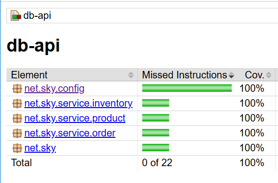

## Auto packages of External JAR

### Reference Documentation
* If **NO** **app.basePackagesToScan** given in application.yml
    , then **AUTO** scan all the packages in External JAR.

* Scan specific packages of External JAR 
  (i.e) scan the packages given in **application.yml**.




##### Scanning specific package by property
```yaml
app:
  basePackagesToScan: net.sky.service.inventory, net.sky.service.order
```

##### Custom Logic to scan packages
```java
@Configuration
public class CustomScanConfig {
    
    @Bean
    @ConditionalOnMissingBean(name = "propertySourcesPlaceholderConfigurer")
    public static PropertySourcesPlaceholderConfigurer propertySourcesPlaceholderConfigurer(){
        return new PropertySourcesPlaceholderConfigurer();
    }

    @ComponentScan(basePackages = "${app.basePackagesToScan:net.sky.service}")
    public static class ComponentScanConfig{

    }
    
}
```